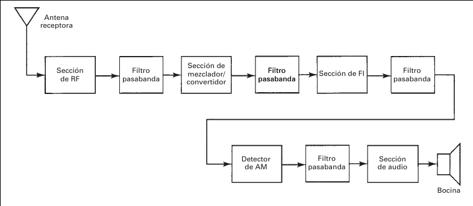
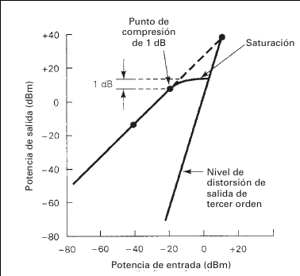
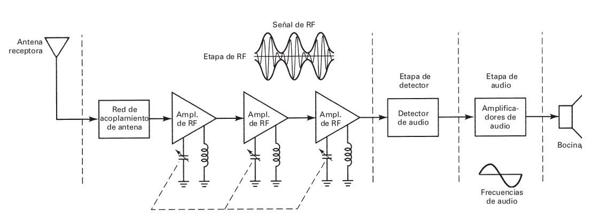
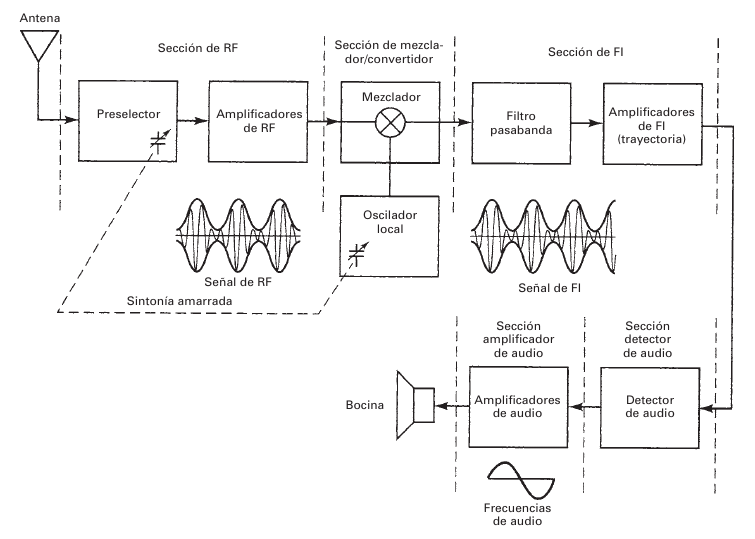

# Introducción

La demodulación de AM es el proceso inverso de modulación de AM. Un receptor convencional de AM de doble banda lateral tan sólo reconvierte una onda de amplitud modulada a la información de la fuente original. Para hacerlo, el receptor debe ser capaz de recibir, amplificar y demodular una onda de AM. También debe ser capaz de limitar la banda del espectro total de radiofrecuencias a determinada banda deseada de frecuencias. El proceso de selección se llama
sintonía del receptor.

# Parámetros del receptor

Hay varios parámetros de uso común para evaluar las posibilidades de un receptor para demodular bien una señal de radio. Los más importantes son la selectividad y la sensibilidad, que se
usan con frecuencia para comparar la calidad de dos radiorreceptores.

## Selectividad 

La selectividad es un parámetro del receptor con el que se mide la capacidad de éste para aceptar una determinada banda de frecuencias y rechazar las demás.

Hay varias formas aceptables de describir la selectividad de un receptor de radio. Una
forma frecuente es simplemente especificar el ancho de banda del receptor en los puntos de -3 dB. Sin embargo, este ancho de banda no es necesariamente una buena forma de determinar
lo bien que el receptor rechaza las frecuencias no deseadas. En consecuencia, se acostumbra
especificar el ancho de banda en dos niveles de atenuación, por ejemplo, -3 dB y -60 dB.
La relación de esos dos anchos de banda se llama factor de forma, y se define con la siguiente
ecuación

## Selectividad

$$ SF = \frac{B_{-60dB}}{{B_{-3dB}}} $$
en donde:
$$ SF = \text{factor de forma (adimensional)} $$
$$ B_{-60dB} = \text{ancho de banda 60 dB abajo del nivel máximo de la señal} $$
$$ B_{-60dB} = \text{ancho de banda 3 dB abajo del nivel máximo de la señal} $$

## Mejoramiento del ancho de banda

El ruido térmico es la forma
más prevaleciente de ruido, y es directamente proporcional al ancho de banda. En consecuencia, si se puede reducir el ancho de banda, el ruido también se reducirá en la misma proporción
y aumentará la relación de potencias de señal a ruido, y mejorará la eficiencia del sistema. Naturalmente hay un límite de la eficiencia del sistema respecto a lo que se puede reducir el ancho
de banda. La relación de señal a ruido en la entrada se calcula en el frente de un receptor, usando el
ancho de banda de RF para medir la potencia del ruido.  La relación de reducción de ruido alcanzada reduciendo el ancho de banda se llama mejoramiento del
ancho de banda (BI, de bandwidth improvement) y se define matemáticamente como sigue

## Mejoramiento del ancho de banda

$$BI = \frac{B_{RF}}{B_{IF}}$$
en donde:
$$BI = \text{mejoramiento del ancho de banda (adimensional)}$$
$$B_{RF} = \text{ancho de banda de RF (hertz)}$$
$$B_{IF} = \text{ancho de banda de FI (heartz)}$$

La reducción correspondiente de ruido debida a la reducción de ancho de banda se llama mejoramiento de la cifra de ruido y se expresa en dB como sigue

$$NF_{ \text{mejoramiento}} = 10 \log 20 = 30 dB$$

## Sensibilidad

La sensibilidad de un receptor es el nivel mínimo de la señal de RF que se puede detectar a la
entrada del receptor y producir una señal útil de información demodulada. La sensibilidad de un receptor de AM depende de la potencia de ruido presente en la entrada
al receptor, la cifra de ruido (indicación del ruido generado en el frente del receptor), la sensibilidad del detector de AM y el factor de mejoramiento de ancho de banda del receptor. La
mejor manera de mejorar la sensibilidad de un receptor es reducir el nivel de ruido.

## Margen dinámico

El margen dinámico de un receptor se define como la diferencia en decibeles entre el nivel de
entrada mínimo necesario para discernir una señal, y el valor de entrada que sobreexcita, o satura, al receptor, y produce distorsión. En términos sencillos, el margen dinámico es el intervalo de potencias de entrada dentro del cual el receptor es útil.

## Fidelidad

La fidelidad es una medida de la capacidad de un sistema de comunicaciones para producir, a la
salida del receptor, una réplica exacta de la información de la fuente original. 

## Fidelidad

{ width=65% }

## Pérdida de inserción

La pérdida de inserción (IL, de insertion loss) es un parámetro asociado con las frecuencias que
caen en la banda de paso de un filtro, y en general se define como la relación de la potencia transferida a una carga, con un filtro en el circuito, entre la potencia transferida a una carga sin el filtro.

En esencia, la pérdida de inserción no es más que la relación de la potencia de salida de un filtro a la potencia de entrada, para frecuencias dentro de la
banda de paso del filtro, y se expresa matemáticamente, en decibeles, como

$$IL_{(dB)}=10\log \frac{P_{\text{sal}}}{P_{\text{ent}}}$$

## Temperatura de ruido y temperatura equivalente de ruido

Como el ruido térmico es directamente proporcional al a temperatura, es razonable expresar al ruido en grados, igual que en watts o en volts.
$$T = \frac{N}{KB}$$
en donde:
$$T = \text{temperatura ambiente (grados kelvin)}$$
$$N = \text{potencia del ruido (watts)}$$
$$K = \text{constante de Boltzmann } (1.38 \times 10^{-23} J/K)$$
$$B = \text{ancho de banda (hertz)}$$

## Temperatura de ruido y temperatura equivalente de ruido

La temperatura equivalente de ruido, $T_{e}$, es un valor hipotético que no se puede medir en
forma directa. Te es un parámetro que se usa con frecuencia en radiorreceptores complicados
con bajo ruido, y no es una cifra de ruido. La Te es una indicación de la reducción de señal a ruido a medida que una señal se propaga a través de un receptor.
$$T_{e} = T(F-1)$$
siendo:
$$T_{e} = \text{temperatura equivalente de ruido (grados kelvin)}$$
$$T = \text{temperatura ambiente (grados kelvin)}$$
$$F = \text{factor de ruido (adimensional)}$$

## Temperatura de ruido y temperatura equivalente de ruido

Table: $(T = 17^{\circ}C)$

|NF(dB)|F(adimensional)|$T_{e}(^{\circ}K)$|
|---|---|---|
|0.8|1.2|58|
|1.17|1.31|90|
|1.5|1.41|119|
|2.0|1.58|168|

Muestra algunos valores de cifra de ruido, factor de ruido y temperatura equivalente de ruido para una temperatura ambiente de $17^{\circ}C (290^{\circ}K)$.

# Receptor de AM

Hay dos tipos básicos de radiorreceptores: coherentes y no coherentes.  Con un receptor coherente o síncrono, las frecuencias generadas en el receptor, que se usan para demodulación, se
sincronizan con las frecuencias de un oscilador, generadas en el transmisor. Con los receptores no
coherentes o asíncronos, no se generan frecuencias en el receptor, o bien las frecuencias que se
usan para demodular son totalmente independientes de la frecuencia de la portadora del transmisor. A la detección no coherente se le llama con frecuencia detección de envolvente.

## Receptor de radiofrecuencia sintonizada

El receptor de radiofrecuencia sintonizada (TRF, de tuned radio-frequency) fue una de las
primeras clases de receptores de AM. Es probable que los receptores TRF sean los de diseño
más sencillo que se consiguen en la actualidad; sin embargo tienen algunos inconvenientes que
limitan su empleo a algunas aplicaciones. 

## Receptor de radiofrecuencia sintonizada

## Receptor de radiofrecuencia sintonizada

### Desventajas

* Ancho de banda inconsistente
* Inestabilidad por gran cantidad de amplificadores RF
* Sus ganancias no son uniformes

## Receptor superheterodino

La selectividad no uniforme del TRF condujo al desarrollo del receptor superheterodino, cerca del
final de la Primera Guerra Mundial. Aunque la calidad del receptor superheterodino ha mejorado mucho respecto a su diseño original, no ha cambiado mucho su configuración básica, y se sigue
usando hoy en una gran variedad de servicios de radiocomunicación.

Heterodinar quiere decir mezclar dos frecuencias en un dispositivo no lineal, o trasladar
una frecuencia a otra usando mezclado no lineal.

## Receptor superheterodino

{ width=90% }

## Receptor superheterodino

### Sección de RF

 La sección de RF consiste en general en una etapa preselectora y en una
amplificadora. Pueden ser circuitos separados, o un solo circuito combinado. El preselector es un
filtro pasabanda sintonizado a banda ancha, con frecuencia central ajustable, que se sintoniza con
la frecuencia portadora deseada. El objetivo principal del preselector es proporcionar suficiente lí-
mite inicial de banda para evitar que entre una radiofrecuencia específica no deseada, llamada
frecuencia imagen. Un receptor puede tener uno o varios amplificadores de RF, o puede
no tener ninguno, dependiendo de la sensibilidad deseada. Algunas de las ventajas de incluir am-
plificadores de RF en un receptor son las siguientes:

1. Mayor ganancia y por consiguiente mayor sensibilidad.
2. Mejor rechazo de frecuencia imagen.
3. Mejor relación de señal a ruido.
4. Mejor selectividad.

## Receptor superheterodino

### Sección de mezclador/convertidor

La etapa de mezclador es un dispositivo no lineal, y su objetivo es conver-
tir las radiofrecuencias en frecuencias intermedias (traslación de RF a FI). El heterodinado se
lleva a cabo en la etapa de mezclador, y las radiofrecuencias se bajan a frecuencias intermedias.
Aunque las frecuencias de portadora y de las bandas laterales se van de RF a FI, la forma de la
envolvente permanece igual y, en consecuencia, la información original que contiene la en-
volvente permanece sin cambios.

## Receptor superheterodino

### Sección de FI

La sección de FI consiste en una serie de amplificadores y filtros pasa-
banda de FI que se llama con frecuencia la trayectoria de FI. La mayor parte de la ganancia y
la selectividad del receptor se hacen en la sección de FI. La frecuencia central y el ancho de
banda de FI son constantes para todas las estaciones, y se escogen de tal manera que su fre-
cuencia sea menor que cualquiera de las señales de RF que se van a recibir.

## Receptor superheterodino

### Sección de detector

 El objetivo de la sección de detector es regresar las señales de FI
a la información de la fuente original. El detector se suele llamar detector de audio, o segundo
detector en receptores de banda de emisión, porque las señales de información tienen frecuen-
cias de audio. El detector puede ser tan sencillo como un solo diodo, o tan complejo como un
lazo de fase cerrada o un demodulador balanceado.

## Receptor superheterodino

### Sección de amplificador de audio

La sección de audio abarca varios amplificadores
de audio en cascada, y una o más bocinas o altoparlantes. La cantidad de amplificadores que se
usen depende de la potencia deseada en la señal de audio.

## Receptor superheterodino

### Funcionamiento del receptor

En un receptor superheterodino, durante el proceso de
demodulación, las señales recibidas pasan por dos o más traslaciones de frecuencia: primero, la
RF se convierte a FI, después la FI se convierte a la información original. Los términos RF y FI
dependen del sistema, y con frecuencia son engañosos porque no necesariamente indican un in-
tervalo específico de frecuencias.

## Receptor superheterodino

### Conversión de frecuencias

La conversión de frecuencia en la etapa de mezclador/con-
vertidor es idéntica a la que se hace en la etapa moduladora de un transmisor, pero en el recep-
tor las frecuencias tienen conversión descendente, y no ascendente como en el transmisor. En
el mezclador/convertidor, las señales de RF se combinan con la frecuencia del oscilador local,
en un dispositivo no lineal. La salida del mezclador contiene una cantidad infinita de frecuen-
cias armónicas y de producto cruzado, que incluyen las frecuencias de suma y diferencia entre
la portadora deseada de RF y la del oscilador local.

# Circuitos receptores de AM

## Circuitos amplificadores de RF

## Circuitos de mezclador/convertidor

## Circuitos amplificadores de FI

## Circuitos detectores de AM

## Controles automáticos de ganancia

## Circuitos de reducción de ruido

## Limitadores y eliminadores de ruido

## Medidas Alternas de señal de ruido

## Receptores de AM en circuito integrado lineal

