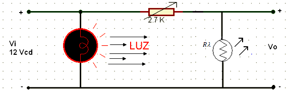
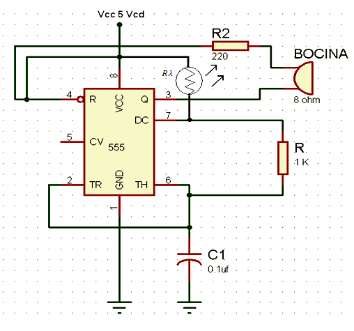

El circuito de la figura uno tiene un pequeño divisor de voltaje conformado por un potenciómetro y una fotorresistencia, lo cual nos permite controlar el voltaje de salida con la luz.

En el circuito de la figura 2 el integrado 555 varía las características del pulso generado de acuerdo a los valores de los componentes que tiene conectado. En este caso la fotorresistencia varía su valor y por lo tanto varía la duración de los pulsos generados por el 555.

