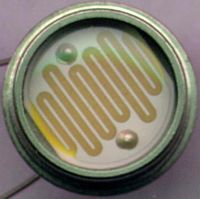
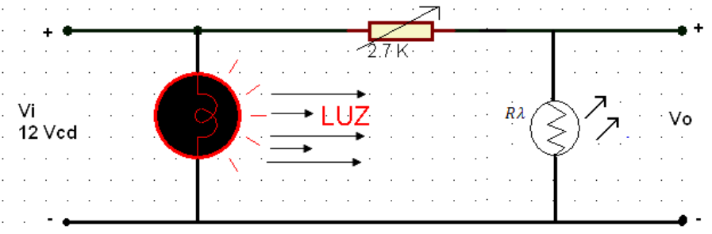
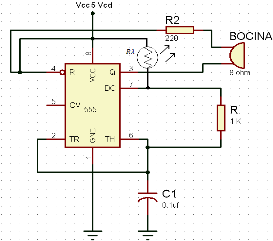

# Introducción

Para ésta práctica probamos el primer dispositivo optoelectrónico que manejaremos en la materia: la fotoresistencia. La fotoresistencia o fotorresistor es un componente electrónico cuya resistencia disminuye con el aumento de la intensidad de luz incidente.

{ width=50% }

## Características de la fotoresistencia

Su funcionamiento se basa en el efecto fotoeléctrico. un fotorresistor está hecho de un semiconductor de alta resistencia como el suflfuro de cadmio, CdS. Si la luz que incide en el dispositivo es de alta frecuencia, los fotones son absorbidos por las elasticidades del semiconductor dando a los electrones la suficiente energía para saltar la banda de conducción. El electrón libre que resulta, y su hueco asociado, conducen la electricidad, de tal modo que disminuye la resistencia. Los valores típicos varían entre 1 MΩ, o más, en la oscuridad y 100 Ω con luz brillante.

La variación del valor de la resistencia tiene cierto retardo, diferente si se pasa de oscuro a iluminado o de iluminado a oscuro. Esto limita a no usar los LDR en aplicaciones en las que la señal luminosa varía con rapidez.

# Desarrollo

Para la práctica de la foto resistencia se realizaron los siguientes circuitos:

{ width=50% }
{ width=50% }
