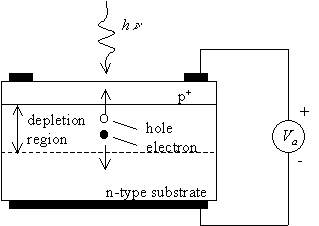
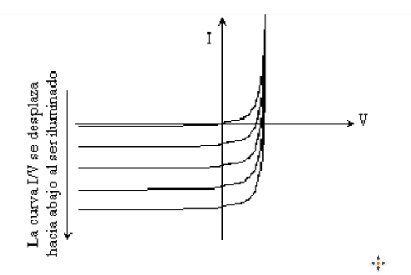
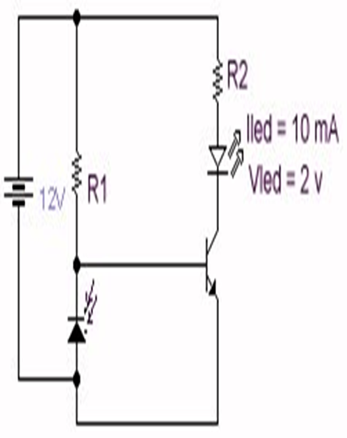

# DEFINE QUE ES UN FOTODIODO

Diodo semiconductor en el cual los rayos luminosos a los que se encuentra sometido provocan variaciones de la corriente eléctrica. Un fotodiodo es un semiconductor construido con una unión PN, sensible a la incidencia de la luz visible o infrarroja. 

# COMO ESTA ESTRUCTURADO, CUAL ES SU SIMBOLO Y EXPLIQUE LA DIFERENCIA ESTRUCTURAL CON LOS DIODOS RECTIFICADORES

El fotodiodo tiene una unión del tipo PN

El fotodiodo consiste de un material tipo P y un material tipo N. El contacto superior suele ser un anillo de metal, el cuál tiene baja resistencia y permite el paso de la luz para que sea absorbida por el semiconductor. Como alternativa se usa un material conductor transparente, como el dióxido de estaño.

Las principales diferencias del fotodiodo y un diodo convencional es que el fotodiodo tiene una región fotosensible expuesta y su principal funcionamiento ocurre en polarización inversa. 

# EXPLIQUE SU FUNCIONAMIENTO UTILIZANDO CURVA CARACTERISTICA DE RESPUESTA (POL DORECTA, POL.INVERSA) 

El funcionamiento del fotodiodo en directa es muy similar al diodo común. La utilidad principal del fotodiodo es en polaridad inversa, donde se incrementa el flujo de corriente dependiendo de la cantidad de luz que se le incide al fotodiodo.

# EXPLIQUE LOS PARAMETROS ELECTRICOS IMPORTANTES DEL FD

* Frecuencia de 2 GHz de respuesta
* Baja corriente en obscuridad
* Larga vida de operación
* Pulso rápido de respuesta

# QUE HECHO ES LO QUE LE DIFERENCIA DEL DIODO RECTIFICADOR

Que un fotodiodo incrementa los pares electrón-hueco, debido a la luz que se incide en la zona fotosensible.

# EXPLICA LOS TRES FORMATOS CLÁSICOS DE OPERACIÓN CON UN FOTODIODO

* __Circuito Abierto:__ la luz genera pares electrón hueco en la zona  de la unión. Los electrones generados se recombinan con los de la zona P de la zona de transición y viceversa. El resultado es un incremento del campo eléctrico que produce fotovoltaje.

* __Corto Circuito:__ $V=0$ en este caso la corriente por el circuito es la corriente $IP$

* __Fotoconductivo:__ funciona así cuando es polarizado en inversa.

# ¿CUÁL ES EL REGIMEN TIPICO EN EL QUE DEBE OPERAR EL FOTODIODO?

El fotodiodo trabaja típicamente en inversa, en formato de operación fotoconductivo.
 
# EXPLICA EL FUNCIONAMIENTO DEL SIGUIENTE CIRCUITO

El transistor a la derecha del circuito funciona como un switch para encender el LED. Al incidir luz sobre el fotodiodo, la corriente que va a la base del transistor se desviará a tierra y, por lo tanto, se apagará el LED.
