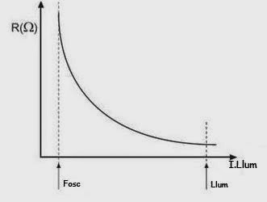
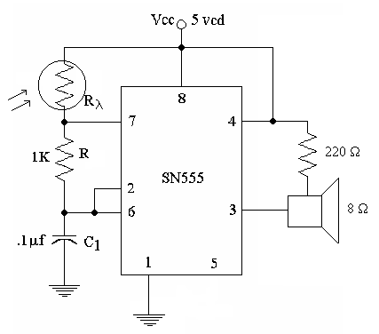
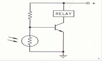

# DEFINE TRANSDUCTOR OPTOELECTRÓNICO

Un transductor optoelectrónico se encarga de convertir energía lumínica en energía eléctrica.

# CUAL ES LA DIFERENCIA ENTRE TRANSDUCTOR Y SENSOR ÓPTICO

Un sensor convierte un valor físico a una señal de salida relativa a la magnitud medida, mientras que el transductor se limita a convertir un tipo de energía a otro. Un sensor podría estar constituido por un transductor.

# DESCRIBE LOS GRUPOS EN LOS QUE SE DIVIDEN LOS DISPOSITIVOS OPTOELECTRÓNICOS

Los circuitos optoelectrónicos se dividen de la siguiente manera:

* __Fotosensibles:__ Pueden producir o controlar cambios en la energía eléctrica.
* __Electroluminisentes:__ Son aquellos que producen luz.
* __Fotovoltaicos:__ Son aquellos convierten la luz en electricidad.

# DEFINE QUE ES UNA FOTORRESISTENCIA (FR)  O LDR

Una fotoresistencia es un dispositivo optoelectrónico cuyo valor resistivo varía en función de la cantidad de luz que se le incide.

# CUAL ES LA ESTRUCTURA DE UNA FR Y QUE TIPO DE MATERIAL SE UTILIZA EN SU FABRICACIÓN

La fotoresistencia está compuesta por dos electrodos y  un material semiconductor de alto valor resistivo (como el sufluro de cadmio) entre ellos.
	
# EXPLICA EL  FUNCIONAMIENTO O RESPUESTA DE UNA FR (UTILIZA GRÁFICAS DE RESPUESTA)

La fotoresistencia tiene mayor sensibilidad a ciertos rangos de longitud de onda. Los rangos de longitud que más afectan a la fotoresistencia dependen del material semiconductor del que esté constituida la foto resistencia. Conforme se incrementa la cantidad de luz incidente en la fotoresistencia, aumenta la conductividad del dispositivo.	

# MENCIONA LAS CARACTERÍSTICAS Y VENTAJAS QUE OFRECE LA FR RESPECTO A OTROS SENSORES ÓPTICOS.

# MENCIONA 5 APLICACIONES DE LA FR O SISTEMAS DONDE SE APLICA

1. Luz nocturna
2. Relé controlado por luz
3. ...

# CUANDO SE SELECCIONA UNA FOTO CELDA, EL INGENIERO DE DISEÑO DEBE PREGUNTARSE DOS COSAS BÁSICAS. ¿CUÁLES SON? Y EXPLIQUELAS.

Rendimiento y ambiente de aplicación.
El rendimiento de la fotoresistencia puede no ser adecuado para respuesta rápida, y el ambiente de aplicación es importante en la toma de decisión.

# ANALIZA Y EXPLICA LOS SIGUIENTES CIRCUITOS CON FR 

El circuito 1 presenta una fotoresistencia que controla la intensidad de encendido de una lámpara.

Se puede observar un integrado 555 que genera una señal con salida a una bocina. La frecuencia de la señal cambiará en función de la cantidad de luz captada por la fotoresistencia.

El circuito 3 es un controlador de relevador con luz. Cuando se incide luz en la fotoresistencia, el relevador se apaga, ya que no llega suficiente corriente al transistor cuando la fotoresistencia comienza a conducir.
