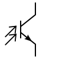
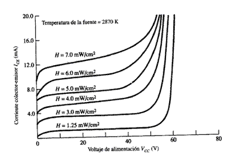
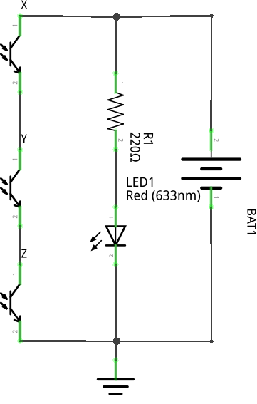

# DEFINE FOTOTRANSISTOR(F.T).

Un fototransistor es un transistor cuya base está expuesta para ser activado por luz.

# EXPRESA LA ESTRUCTURA Y SÍMBOLO DEL FOTOTRANSISTOR.

El fototransitor está compuesto de tres capas de material semiconductor, lo cual no lo hace muy distinto del transistor común. El fototransistor cuenta con las tres terminales, emisor, base y colector.

Su símbolo se caracteriza por ser muy similar al símbolo del transistor, pero se reemplaza la conexión de la base por un par de flechas que indican la incidencia de luz en el dispositivo.

# EXPLICA EL FUNCIONAMIENTO O RESPUESTA DEL F.T (UTILIZA CURVA CARACTERISTICA DE RESPUESTA  DE SALIDA ESPECTRAL).

La corriente de colector es gobernada por la energía fotónica que incide sobre la unión base-colector; y es importante reconocer que la corriente de base del fototransistor aumenta a medida que la presencia de un haz de luz sea más intensa sobre la misma. Por tanto, si se obtienen curvas de colector tomando la iluminación como parámetro, los resultados son parecidos a los de un transistor bipolar normal donde se toma la intensidad de base como parámetro.

# ¿CUALES SON LAS CARACTERISTICAS  ELECTRICAS IMPORTANTES A CONSIDERAR DEL F.T.?

* Ganancia
* Corriente de base
* Corriente del colector

# ¿QUE  ES UN FOTODARLINGTON?

Es un dispositivo semiconductor compuesto de un fototransistor y un transistor conectado al emisor del primero. Es un dispositivo de alta ganancia.

# EXPLIQUE Y  ANALICE 2 APLICACIONES CON FOTOTRANSISTOR.

* __Sensor de presencia:__ Es un circuito sencillo que utiliza fototransistores, transistores en configuración darlington y un IRLED para detectar presencia de objetos. Comunmente se utiliza en las puertas automáticas.

* __Control remoto:__ Se utiliza como receptor de señales en los controles remotos.

# EXPRESE LA SIGUIENTE FUNCIÓN LÓGICA CON FOTOTRANSISTORES.

$$S = (\overline{XY}) + \overline{Z}$$ 

La función se puede reducir a lo siguiente:

$$S = (\overline{XYZ})$$

Con lo cual nuestro circuito quedaría de la siguiente manera:

 
