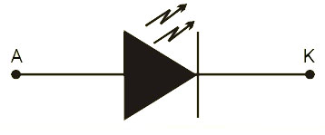

# 1 ¿EN QUE AÑO SE INVENTO EL LASER?

En 1960.

# 2 ¿QUE SIGNIFICAN LAS SIGLAS LASER?

Light Amplification by Stimulated Emission of Radiation (Luz Amplificada por Emisión de Radiación Estimulada).

# 3 EXPLIQUE LAS PROPIEDADES DE LA RADIACIÓN LASER:

* __Monocromaticidad:__ Un sólo color, es decir que es casi de una sola longitud de onda.
* __Direccionalidad:__ El haz se mueve en una cierta dirección del espacio. 
* __Coherencia:__ Las longitudes de ondas que generan la radiación se encuentran en fase, es decir que empiezan al mismo tiempo y mantienen la fase relativa mientras avanzan.

# 4 ¿DE QUE DEPENDE LA COHERENCIA DE LA LUZ LASER?

Depende de la sincronización de la frecuencia de las ondas en las diferentes ondas de radiación electromagnética. 

# 5 EXPLIQUE A QUE SE REFIERE LA INVERSIÓN DE POBLACIÓN Y CUAL ES  SU IMPORTANCIA  EN LA EMISIÓN LASER:

Es cuando uno de los niveles de energía más alto tiene más átomos que un nivel de energía más bajo. Por lo tanto se genera un aumento en el número de átomos excitados que buscan una salida para esa sobrepoblación; esta salida la encuentran en uno de los espejos generando así la respuesta láser. Esta condición es una de las características necesarias para producir la acción láser.

# 6 ¿QUE ELEMENTOS BÁSICOS SE NECESITAN PARA GENERAR UN SISTEMA LASER?

Medio activo, es donde se mueven las ondas electromagnéticas, actuando como amplificador óptico; mecanismo de excitación, es la forma en que se aumentara el número de átomos excitados, la forma más común es la excitación óptica (radiación electromagnética) también conocida como bombeo óptico; retroalimentación óptica, esta se da mediante los espejos, puestos en los extremos del área otorgada para el medio activo, cumpliendo con dos funciones: 1. Incrementar la longitud del medio activo, haciendo que el haz pase a través de él muchas veces y 2. Determinar las condiciones límite  para los campos electromagnéticos dentro de la cavidad láser; y el acoplador de salida, que es la perforación en una de los espejos para la salida de la sobrepoblación de los átomos excitados por el bombeo óptico.

# 7 EXPLIQUE TRES TIPOS DE LASER (los básicos):

1. Láser de gas, su medio activo es un gas a baja presión y se pueden excitar con dos técnicas: por una descarga eléctrica o mediante bombeo óptico; este tipo de láser permite posibilitar una descarga eléctrica en un largo espacio, mientras los electrodos están en los extremos de un tubo largo y obtener líneas espectrales estrechas, minimizando el ensanchamiento debido a las colisiones entre átomos. A su vez estos se dividen en tres grupos (determinados por el tipo de composición de su medio activo) que pueden ser: átomos, iones o moléculas.
2. Láser de estado sólido, en este estado los átomos están cerca uno de otros por lo que su interacción es fuerte y su rango de espectro de emisión son más amplios que en los gases. Este amplio espectro de absorción permite el bombeo del medio activo con una fuente de luz convencional, la cual tiene un amplio espectro de emisión. Por otro lado, en el bombeo óptico se utilizan dos tipos de fuentes electromagnéticas: fuente de espectro electromagnético de banda ancha (lámparas de flash, incandescentes, de arco, etc.) y fuente de espectro electromagnético de banda estrecha (otros láseres).
3. Láser de colorante (líquido), se puede considerar como un dispositivo especial para convertir la radiación electromagnética de una longitud de onda, en otra longitud de onda que se puede sintonizar. La salida de este tipo de láser es siempre radiación coherente sintonizable en una región específica del espectro, determinada por el tipo de material colorante. Su medio activo está compuesto por moléculas coloreadas disueltas en un líquido (normalmente u tipo de alcohol); debido a esta interacción de moléculas se produce un ensanchamiento de los niveles de energía vibracional, por lo que se forma un espectro de bandas anchas.

# 8 ¿EN QUE RANGO DE EL ESPECTRO ELECTROMAGNETICO SE CLASIFICARIA LA LUZ LASER? ¿POR QUÉ?

La luz láser abarca desde la radiación infrarroja hasta los rayos x. Esto debido a que el medio activo de los láseres puede derivarse de elementos químicos con este rango de longitudes de onda, creando así diferentes tipos de láser.

# 9 MENCIONE Y EXPLIQUE DOS TIPOS DE LASER DE NUEVA TECNOLOGÍA:

Láseres de Estado Sólido Bombeados por Láseres de Diodo (DPSSL).  En lugar de una fuente de bombeo de amplio espectro, se usan Láseres de Diodo como fuente de excitación.  La longitud de onda en estos láseres de diodo se puede ajustar para coincidir con el espectro de absorción del medio activo.  Estos láseres de diodo son fuentes de excitación muy eficaces, y casi toda la luz se absorbe por el medio activo. Por lo tanto, se pierde muy poca energía (convertida en calor no deseado). 
Estos láseres de estado sólido que son bombeados por láseres de diodo son llamados: " Diode Pumped Solid State Lasers".
Láser Sin Inversión (Laser Without Inversion (LWI)), en el cuál la acción láser puede ocurrir sin que se produzca inversión de población.

# 10 EXPLIQUE EL DIODO LASER (estructura, símbolo, curva característica, diferencias con diodo rectificador, etc.)

## Símbolo

## Construcción y operación básica

Se forma una unión pn con dos capas de arseniuro de galio dopado; la longitud de la unión pn guarda relación precisa con la longitud de onda de la luz que va a ser emitida. Existe una superficie altamente reflejante en un extremo de la unión pn y una parcialmente reflejante en el otro extremo, por lo que se forma una cavidad resonante para los fotones. Unos conductores externos proporcionan las conexiones de ánodo y cátodo.

El diodo laser funciona de la siguiente manera: 

Una fuente de voltaje externa polariza en directa el diodo láser. Conforme los electrones se desplazan 

# 11 ¿DONDE SE APLICA O UTILIZAN EL o los LASER? 

Los láseres están en todas partes, desde lectores de códigos de barras que usan un láser para convertir un código de barras impreso en un número que un ordenador pueda procesar hasta impresoras o reproductores de DVD o CD en los que un rayo láser semiconductor rebota en el disco giratorio para convertir su patrón impreso de datos en números y un chip en un ordenador convierte estos números en imágenes y sonido.

# 12 ¿QUE ES LA HOLOGRAFIA Y COMO SE LOGRA?

Es una técnica especial de producción de fotografías tridimensionales de un objeto utilizando rayos de luz láser; proporcionando más información sobre el objeto que una fotografía normal en dos dimensiones, ya que permite verla en relieve y, además, variando la posición del espectador se pueden obtener diferentes perspectivas del objeto holografiado.

# 13  DIAGRAMA  Y EXPLICA UN CIRCUITO ACTIVADO CON UN DIODO  LASER Y DEMUESTRALO EN EL LABORATORIO (práctica de aplicación con láser).
