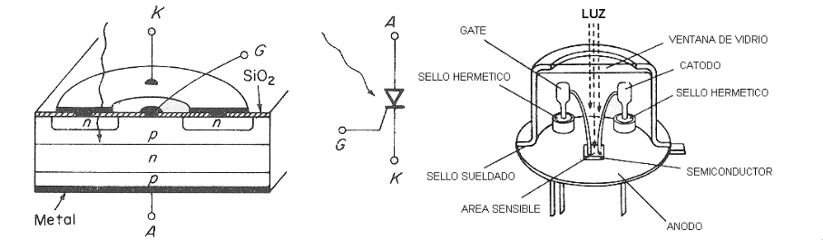
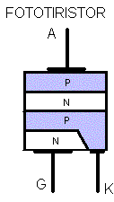
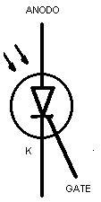
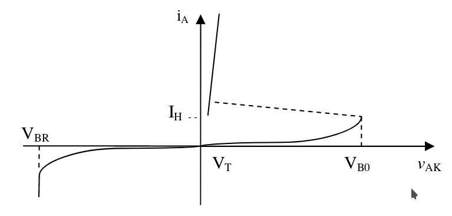
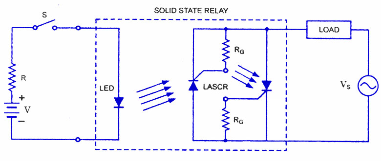

# Concepto

El término tiristor, incluye todos los dispositivos semiconductores los cuales presentan un funcionamiento inherente como dispositivos de corte y conducción, poseen una estructura de cuatro capas PNPN con tres uniones PN intermedias y tres terminales accesibles denominadas ánodo, cátodo y compuerta (gate). Existen dos formas de operación, una es bidireccional (Triac) y la otra es unidireccional (SCR). Los fototiristores (LASCR o Rectificador controlado de silicio fotoactivo) son como los fototransistores o FET muy similares a sus correspondientes convencionales, excepto en la adición de una ventana o lente para enfocar la luz en un área apropiada. 

El LASCR tiene varias similitudes con el SCR. Es unidireccional, conmutador casi ideal, rectificador y amplificador a la vez. Se utiliza como interruptor electrónico, esto quiere decir que en su comportamiento tiene dos estados de operación: en el estado de apagado o de bloqueo, idealmente el SCR actúa como un circuito abierto entre el ánodo y el cátodo; en realidad, en vez de haber un circuito abierto, existe una resistencia muy alta. El otro es el estado de conducción, el SCR actúa idealmente como un corto circuito entre el ánodo y el cátodo; en realidad presenta una resistencia muy baja.

# Estructura

En la figura 1 se puede observar que el fototiristor tiene una ventana de vidrio por la cual ingresa luz. La luz ingresa hacia la compuerta gate.

Estructuralmente, los fototiristores consisten en capas alternadas de semiconductores de silicio tipo P y N, de modo que se forman varias junturas PN. La carga se aplica a través de todas las junturas y  la  corriente  de  disparo  sólo  a  una.  Presentan  una  respuesta  rápida  a  la  conmutación,  manejan potencias  elevadas  y  tienen  una  larga  vida  útil.

El símbolo del fototiristor es muy similar al símbolo del tiristor SCR. En éste caso, el símbolo se encuentra encerrado en un círculo y tiene flechas, indicando que el dispositivo recibe luz para su funcionamiento. 

# Curva característica

El LASCR comienza la conducción cuando está polarizado en directa. Para este propósito, el cátodo se mantiene en polarización negativa y el ánodo está en polarización positiva.

# Aplicación

