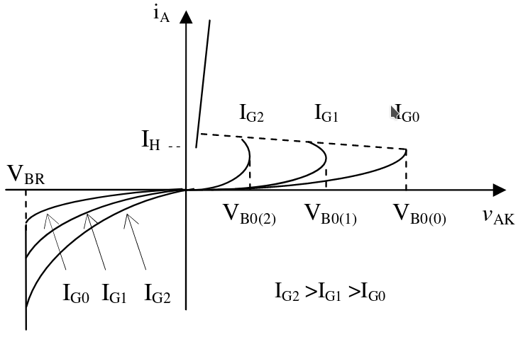
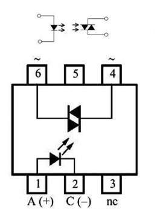
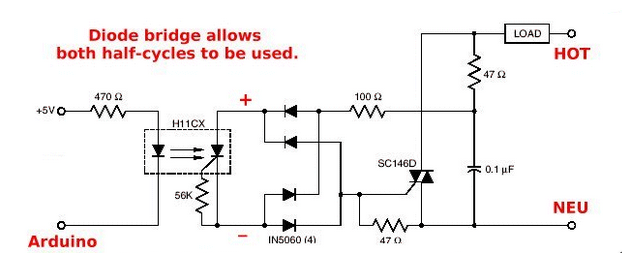

\tableofcontents

# Concepto

El término tiristor, incluye todos los dispositivos semiconductores los cuales presentan un funcionamiento inherente como dispositivos de corte y conducción, poseen una estructura de cuatro capas PNPN con tres uniones PN intermedias y tres terminales accesibles denominadas ánodo, cátodo y compuerta (gate). Existen dos formas de operación, una es bidireccional (Triac) y la otra es unidireccional (SCR). Los fototiristores (LASCR o Rectificador controlado de silicio fotoactivo) son como los fototransistores o FET muy similares a sus correspondientes convencionales, excepto en la adición de una ventana o lente para enfocar la luz en un área apropiada. 

El LASCR tiene varias similitudes con el SCR. Es unidireccional, conmutador casi ideal, rectificador y amplificador a la vez. Se utiliza como interruptor electrónico, esto quiere decir que en su comportamiento tiene dos estados de operación: en el estado de apagado o de bloqueo, idealmente el SCR actúa como un circuito abierto entre el ánodo y el cátodo; en realidad, en vez de haber un circuito abierto, existe una resistencia muy alta. El otro es el estado de conducción, el SCR actúa idealmente como un corto circuito entre el ánodo y el cátodo; en realidad presenta una resistencia muy baja.

# Estructura

En la figura 1 se puede observar que el fototiristor tiene una ventana de vidrio por la cual ingresa luz. La luz ingresa hacia la compuerta gate.

Estructuralmente, los fototiristores consisten en capas alternadas de semiconductores de silicio tipo P y N, de modo que se forman varias junturas PN. La carga se aplica a través de todas las junturas y  la  corriente  de  disparo  sólo  a  una.  Presentan  una  respuesta  rápida  a  la  conmutación,  manejan potencias  elevadas  y  tienen  una  larga  vida  útil.

# Símbolo

El símbolo del fototiristor es muy similar al símbolo del tiristor SCR. En éste caso, el símbolo se encuentra encerrado en un círculo y tiene flechas, indicando que el dispositivo recibe luz para su funcionamiento. 

# Características de un LASCR

La especificación de voltaje de un LASCR puede llegar tan alto como 4 kv a 1500 A, con una potencia de disparo luminoso de menos de 100mw. El di/dt típico es 250 A/ms y el dv/dt puede ser tan alto como 2000v/ms. La frecuencia de conmutación es de hasta 2kHz, estos tiristores normalmente disponen de conexiones especiales para ser disparados con fibra óptica. Un LASCR ofrece total aislamiento eléctrico entre la fuente de disparo luminoso y el dispositivo de conmutación de un convertidor de potencia, que flota a un potencial tan alto como unos cuantos cientos de kilovoltios. 

# Curva característica

El LASCR comienza la conducción cuando está polarizado en directa. Para este propósito, el cátodo se mantiene en polarización negativa y el ánodo está en polarización positiva.

Cuando se selecciona un SCR para una aplicación específica se debe asegurar que tanto su tensión de ruptura en directo (VBO) como su tensión de ruptura en inverso (VRSOM) deben estar por encima del voltaje aplicado, para asegurar una acción de control y no una activación natural del dispositivo.

# Aplicaciones

Los LASRC se utilizan en aplicaciones de alto voltaje y corriente por ejemplo, transmisión de cd de alto voltaje (HVDC) y compensación de potencia reactiva estática o de volt-amperes reactivos (VAR). Un LASCR ofrece total aislamiento eléctrico entre la fuente de disparo luminoso y el dispositivo de conmutación de un convertidor de potencia, que flota a un potencial tan alto como unos cuantos cientos de kilovoltios. 

## Usos comunes

* Alarmas antirrobo
* Detectores de presencia en puertas y ascensores
* Circuitos de control óptico en general
* Relevadores
* Control de fase
* Control de motores
* Y una variedad de aplicaciones en computadoras

# Fototriac

 

(Figura 5) Pertenecen a la familia de los optoacopladores, la diferencia esta en la utilización de un triac en vez del transistor que se utiliza internamente en este tipo de componente. Por tanto un TRIAC o Tríodo para Corriente alterna es un dispositivo semiconductor, de la familia de los transistores. La diferencia con un tiristor convencional es que éste es unidireccional y el TRIAC es bidireccional. 

# Relay de estado sólido

El relay de estado sólido (Figura 6) consiste en dos fototiristores conectados en paralelo invertido para obtener conducción en ambos medios-ciclos del la fuente de corriente alterna. Se utilizan resistencias para controlar la sensibilidad del relay. Usualmente los tres componentes activos (dos LASCR y un LED) y las resistencias del los LASCR están en el mismo empaquetado.

# Circuito de aplicación

El circuito de aplicación (Figura 7) utiliza un optocoplador H11CX conectado a un arduino para controlar el disparo de un TRIAC SC146D y activar la carga.
