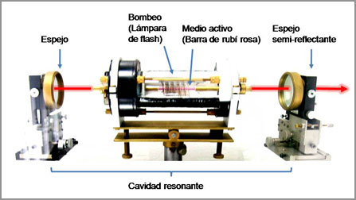

# Láser

Un láser (del acrónimo inglés LASER, light amplification by stimulated emission of radiation; amplificación de luz por emisión estimulada de radiación) es un dispositivo que utiliza un efecto de la mecánica cuántica, la emisión inducida o estimulada, para generar un haz de luz coherente tanto espacial como temporalmente. La coherencia espacial se corresponde con la capacidad de un haz para permanecer con un pequeño tamaño al transmitirse por el vacío en largas distancias y la coherencia temporal se relaciona con la capacidad para concentrar la emisión en un rango espectral muy estrecho.

## Funcionamiento

Cualquier láser contiene al menos tres elementos fundamentales: un medio activo, un sistema de bombeo y una cavidad resonante. El medio activo es el material (sólido, líquido o gaseoso) que emite la luz. Para que emita luz el medio activo hay que excitarlo de alguna manera, del mismo modo que el filamento de una bombilla necesita una corriente eléctrica que pase por él; ese es el cometido del sistema de bombeo. El sistema de bombeo puede consistir en otro láser, una lámpara convencional, o una corriente o descarga eléctrica, dependiendo del tipo de láser. El medio activo se coloca entre dos espejos que forman una cavidad resonante, esto es, la luz rebota entre los dos espejos y ayuda a la amplificación del mismo modo que la caja de resonancia de una guitarra amplifica las ondas acústicas. Uno de los espejos es semi-reflectante por lo que parte de la luz amplificada sale de la cavidad resonante en forma de haz.  

El secreto del láser está en el medio activo que, debidamente bombeado, debe posibilitar la inversión de población y la emisión estimulada. Además de estos componentes básicos un láser puede tener otros dispositivos intracavidad para modificar o controlar las características de la luz emitida (longitud de onda, pulsación, etc.), o elementos externos a la cavidad para amplificar la luz (a través de otro medio activo con su correspondiente bombeo) o modificar la duración de pulso, tasa de repetición, longitud de onda, polarización, etc.

# CCD

Un dispositivo de carga acoplada (en inglés charge-coupled device, conocido también como CCD) es un circuito integrado que contiene un número determinado de condensadores enlazados o acoplados. Bajo el control de un circuito interno, cada condensador puede transferir su carga eléctrica a uno o a varios de los condensadores que estén a su lado en el circuito impreso. La alternativa digital a los CCD son los dispositivos CMOS (complementary metal oxide semiconductor) utilizados en algunas cámaras digitales y en numerosas cámaras web. En la actualidad los CCD son mucho más populares en aplicaciones profesionales y en cámaras digitales.

Los primeros dispositivos CCD fueron inventados por Willard Boyle y George E. Smith el 17 de octubre de 1969 en los laboratorios Bell, ambos premiados con el Premio Nobel de Física de 2009 precisamente por este invento.

## Funcionamiento

El funcionamiento de un detector CCD se puede resumir así:

* Cada píxel de la matriz CCD corresponde a un elemento semiconductor dentro de un condensador eléctrico.
* Un fotón incidente crea un fotoelectrón cuando da a un electrón del semiconductor la energía necesaria para pasar el umbral energético (gap).
* Los fotoelectrones son guardados en el pozo de potencial (que no es más que un píxel correctamente polarizado).
* La lectura de estos fotoelectrones es controlada por la polarización de los píxeles, determinada por transistores de efecto campo. Esta lectura ocurre, o bien directamente mientras un obturador tapa la objeto (la fuente de luz), o bien por transferencia de trama. En este caso, una mitad de la superficie del CCD se dedica a recibir la señal, mientras que la otra solamente ve los fotones durante su tránsito hacia el registro de lectura.

### Definición de los Pixeles

Una cámara CCD está compuesta por líneas y columnas, definiendo los píxeles. El principio de lectura de una CCD lleva a definir los límites de las columnas gracias a un dopaje p grabado en el silicio. En cambio, los límites de las líneas están definidos gracias a una polarización controlada. Un píxel es así un pozo de potencial estático durante la adquisición de la señal, y después variable durante la lectura de la información.

 
