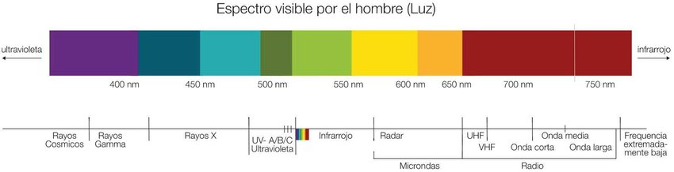
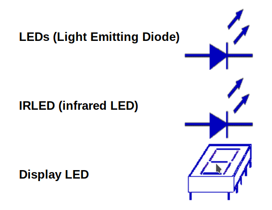
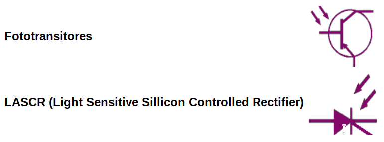
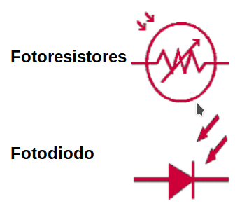
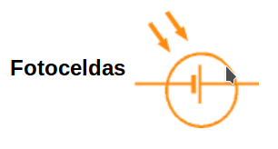

# Optoelectrónica

La optoelectrónica es la rama de la electrónica que trata con la luz. Los dispositivos ópticos son aquellos que responden a la radiación de la luz, o que emiten radiación. Estos dispositivos responden a una frecuencia específica de radiación. Básicamente hay tres bandas en el espectro óptico de frecuencias:

* __Infrarojo:__ Esta banda corresponde a las longitudes de onda de la luz que son muy largas para ser vistas por el ojo humano.

* __Visible:__ Corresponde a las longitudes de onda a las cuales responde el ojo humano. Comprende aproximadamente entre los 400nm y 800nm de longitud de onda. En esta banda están comprendidos todos los es que el ojo humano distingue:

* __Ultravioleta:__ Longitudes de onda que son muy cortas para ser vistas por los humanos.

## Clasificación de los dispositivos optoelectrónicos

Todos los dipositivos optoelectrónicos realizan una de dos funciones, las cuales se utilizan para su clasificación:

### Conversión de energía eléctrica a energía radiante

A estos dispositivos se les llama electroluminicentes. Es importante aclarar que la mayoría de cristales de semiconductores al ser bombardeados con fotones, calor o electrones emiten luz visible o en la banda infraroja. Sin embargo, específicamente llamamos electroluminiscentes a aquéllos que responden a la corriente eléctrica. Al aplicarle una corriente a dichos dispositivos, los electrones se mueven del material N hacia el P y se combinan con los huecos. Cuando los electrones se mueven del alto estado energético de la banda de conducción al bajo estado energético de la banda de valencia, fotones de energía son liberados.

###  Conversión de energía radiante a energía eléctrica

Este tipo de dispositivos a menudo son llamados fotodetectores. En este caso, la energía que entra al cristal de semiconductor excita a los electrones a niveles más altos de energía, dejando huecos atrás. Posteriormente estos electrones y huecos se alejan unos de otros, conformando una corriente eléctrica.

* __Fotoemisores:__ Que emiten electrones cuando existe energía radiante que incide sobre material sensible a dicha radiación. 

* __Fotoconductores:__ Que cambian su resistencia eléctrica debido a la exposición a energía radiante.

* __Fotovoltaicos:__ Los cuales generan un voltaje al exponerse a energía radiante.

# Fotónica

La fotónica es la ciencia de la generación, control y detección de fotones, en particular en el espectro visible e infrarrojo cercano, pero que también se extiende a otras porciones del espectro que incluyen al ultravioleta (longitudes de onda de 0,2 - 0,35 µm), infrarrojo de onda larga (8 - 12 µm) e infrarrojo lejano (75 - 150 µm), en donde actualmente se están desarrollando de manera activa los láser de cascada cuántica. La fotónica surge como resultado de los primeros semiconductores emisores de luz inventados a principios de 1960 en General Electric, MIT Lincoln Laboratory, IBM, y RCA y hechos factibles en la práctica por Zhores Alferov y Dmitri Z. Garbuzov y colaboradores que trabajaban en el Ioffe Physico-Technical Institute y casi simultáneamente por Izuo Hayashi y Mort Panish que trabajaban en los Bell Telephone Laboratories.

De la misma manera que las aplicaciones de la electrónica se han ampliado de manera contundente desde que el primer transistor fuera inventado en 1948, las nuevas aplicaciones particulares de la fotónica siguen apareciendo. Aquellas de las cuales se consideran aplicaciones consolidadas y económicamente importantes de los dispositivos fotónicos de semiconductores incluyen: almacenamiento óptico de datos, telecomunicaciones por fibra óptica, impresión láser (basada en la xerografía), visualizadores y bombeo óptico en láseres de alta potencia. Las aplicaciones potenciales de la fotónica son virtualmente ilimitadas e incluyen: síntesis química, diagnóstico médico, comunicación de datos on-chip, defensa con armas láser y obtención de energía mediante fusión, entre otras aplicaciones interesantes.

# Relación fotón electrón

A muy altas energías, por ejemplo cuando la luz puede interactuar con un átomo la luz se comporta como una partícula golpeando electrones fuera del átomo. A esta partícula elemental se le llama fotón.

El fotón se puede entender como un paquete de energía electromagnética, o luz. Éste fue propuesto por Albert Einstein para explicar el efecto fotoeléctrico (cuando la luz golpea con un electrón de un átomo y lo saca fuera del átomo). 

Cuando la luz choca con la superficie de ciertos metales, se emiten electrones. Este fenómeno es el denominado Efecto Fotoeléctrico. Sus principales características son:

* La emisión de electrones solamente ocurre cuando la frecuencia de la luz incidente excede un valor umbral determinado $(ν0)$.

* El número de electrones emitido depende de la intensidad de la radiación incidente

* Las energías cinéticas de los electrones emitidos dependen de la frecuencia de la luz.

Estas observaciones no podían explicarse mediante la teoría ondulatoria clásica.

En 1905, Albert Einstein propuso que la radiación electromagnética tiene propiedades corpusculares y que las "partículas" de luz, denominadas Fotones, tienen una energía característica dada por la ecuación de Planck, $E=hν$.

En el modelo corpuscular, un fotón de energía hν golpea a un electrón que absorbe la energía del fotón. Si la energía del fotón hν es mayor que la energía de unión del electrón a la superficie, una magnitud conocida como función de trabajo, se libera un fotoelectrón. La frecuencia de la luz $(ν0)$, la mínima necesaría para provocar el efecto fotoeléctrico, se denomina frecuencia umbral.

# Sensor de luz

Un sensor fotoeléctrico o fotocélula es un dispositivo electrónico que responde al cambio en la intensidad de la luz. Estos sensores requieren de un componente emisor que genera la luz, y un componente receptor que percibe la luz generada por el emisor.

Todos los diferentes modos de censado se basan en este principio de funcionamiento. Están diseñados especialmente para la detección, clasificación y posicionado de objetos; la detección de formas, colores y diferencias de superficie, incluso bajo condiciones ambientales extremas.

Los sensores de luz se usan para detectar el nivel de luz y producir una señal de salida representativa respecto a la cantidad de luz detectada. Un sensor de luz incluye un transductor fotoeléctrico para convertir la luz a una señal eléctrica y puede incluir electrónica para condicionamiento de la señal, compensación y formateo de la señal de salida.

El sensor de luz más común es el LDR -Light Dependant Resistor o Resistor dependiente de la luz-.Un LDR es básicamente un resistor que cambia su resistencia cuando cambia la intensidad de la luz.

Existen tres tipos de sensores fotoeléctricos, los sensores por barrera de luz, reflexión sobre espejo o reflexión sobre objetos. 

# Tipos de Sensores de luz

## Barrera de luz

Las barreras tipo emisor-receptor están compuestas de dos partes, un componente que emite el haz de luz, y otro componente que lo recibe. Se establece un área de detección donde el objeto a detectar es reconocido cuando el mismo interrumpe el haz de luz. Debido a que el modo de operación de esta clase de sensores se basa en la interrupción del haz de luz, la detección no se ve afectada por el color, la textura o el brillo del objeto a detectar. Estos sensores operan de una manera precisa cuando el emisor y el receptor se encuentran alineados.

### Ventajas e Inconvenientes

La luz solo tiene que atravesar el espacio de trabajo una vez, por lo que se favorecen grandes distancias de funcionamiento, hasta 60 metros. Son apropiadas para condiciones ambientales poco favorables, como suciedad, humedad, o utilización a la intemperie, así como independientemente del color del objeto realiza una detección precisa del objeto.

La instalación se ve dificultada por tener que colocar dos aparatos separados y con los ejes ópticos alineados de manera precisa y delicada, ya que el detector emite en infrarrojos. Además de la imposibilidad de que los objetos a detectar sean transparentes.

### Precauciones de montaje

A la hora del montaje hay que tener en cuenta las superficies reflectantes cercanas a los dispositivos, provocando un mal funcionamiento de la fotocélula. También hay que tener en cuenta las posibles interferencias mutuas por la cercanía de varios de estos dispositivos, además de controlar los ambientes sucios, ya que la suciedad afecta negativamente en la lente emisora.

## Reflexión sobre espejo

Tienen el componente emisor y el componente receptor en un solo cuerpo, el haz de luz se establece mediante la utilización de un reflector catadióptrico. El objeto es detectado cuando el haz formado entre el componente emisor, el reflector y el componente receptor es interrumpido. Debido a esto, la detección no es afectada por el color del mismo. La ventaja de las barreras réflex es que el cableado es en un solo lado, a diferencia de las barreras emisor-receptor que es en ambos lados.

### Ventajas e Inconvenientes

En estas fotocélulas el haz de luz recorre dos veces la distancia de detección, con lo cual las distancias de trabajo que se consiguen son medias (de unos 15 metros). El espejo es fácil de instalar, y no se necesita cableado hasta el mismo, por lo que solo hay que cablear un detector. Además de ser válidos para detección de objetos opacos, también cubren eficientemente aplicaciones con detección de objetos con cierto grado de transparencia.

El problema más llamativo es que el objeto a detectar tiene que ser mayor que el espejo y, a ser posible, no reflectante, además de que la alineación tiene que ser precisa.
Precauciones de montaje

Un objeto con superficie reflectante puede provocar errores de detección. esto se puede evitar haciendo que la reflexión del objeto a detectar no tenga la misma inclinación que el haz del detector.

## Reflexión sobre objeto

La luz infrarroja viaja en línea recta, en el momento en que un objeto se interpone el haz de luz rebota contra este y cambia de dirección permitiendo que la luz sea enviada al receptor y el elemento sea censado, un objeto de color negro no es detectado ya que este color absorbe la luz y el sensor no experimenta cambios. Hay dos tipos de fotocélulas de reflexión sobre objeto, las de reflexión difusa y las de reflexión definida.

### Reflexión difusa

En las fotocélulas de reflexión difusa sobre el objeto el emisor lanza un haz de luz; los rayos del haz se pierden en el espacio si no hay objeto, pero cuando hay presencia de objeto, la superficie de éste produce una reflexión difusa de la luz, parte de la cual incide sobre el receptor y se cambia así la señal de salida de la fotocélula.

### Reflexión definida

La reflexión en la superficie del objeto a detectar por las fotocélulas de reflexión definida normalmente es de carácter difuso, como en los sensores de reflexión difusa, o sea que los rayos reflejados salen sin una trayectoria determinada.

Esto es muy importante, para no caer en la falsa idea de que la diferencia respecto a los sensores de reflexión difusa está en el tipo de reflexión; lo está en el tipo de óptica empleada.

En las fotocélulas de reflexión definida la fuente de luz está a una distancia mayor que la distancia focal, por lo que el haz converge a un punto del eje óptico

### Ventajas e Inconvenientes

Las fotocélulas de reflexión sobre objeto se componen únicamente de un emisor y un receptor montados bajo una misma carcasa, por lo que el montaje es sencillo y rápido. En estas fotocélulas el haz de luz recorre dos veces la distancia de detección y además el objeto puede ser de reflectividad baja, por lo que sólo se consiguen distancias de detección pequeñas (por lo general menos de un metro.

## Tipos de sensores de luz

*  Fotodiodo
*  Fototransistor
*  Célula fotoeléctrica
*  Sensor CCD
*  Sensor CMOS
