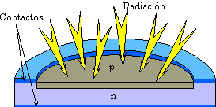
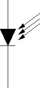
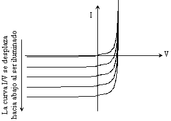
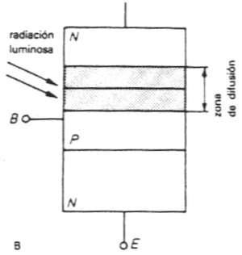
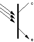
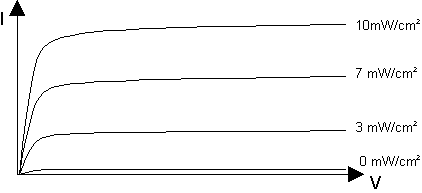

# Fotodiodo

Un fotodiodo es un semiconductor construido con una unión PN, sensible a la incidencia de la luz visible o infrarroja. Para que su funcionamiento sea correcto se polariza inversamente, con lo que se producirá una cierta circulación de corriente cuando sea excitado por la luz. Debido a su construcción, los fotodiodos se comportan como células fotovoltaicas, es decir, iluminados en ausencia de una fuente exterior de energía generan una corriente muy pequeña con el positivo en el ánodo y el negativo en el cátodo. 

## Principio de operación

Un fotodiodo es una unión PN o estructura P-I-N. Cuando un haz de luz de suficiente energía incide en el diodo, excita un electrón dándole movimiento y crea un hueco con carga positiva. Si la absorción ocurre en la zona de agotamiento de la unión, o a una distancia de difusión de él, estos portadores son retirados de la unión por el campo de la zona de agotamiento, produciendo una fotocorriente.

Los diodos tienen un sentido normal de circulación de corriente, que se llama polarización directa. En ese sentido el diodo deja pasar la corriente eléctrica y prácticamente no lo permite en el inverso. En el fotodiodo la corriente (que varía con los cambios de la luz) es la que circula en sentido inverso al permitido por la juntura del diodo. Es decir, para su funcionamiento el fotodiodo es polarizado de manera inversa. Se producirá un aumento de la circulación de corriente cuando el diodo es excitado por la luz. En ausencia de luz la corriente presente es muy pequeña y recibe el nombre de corriente de oscuridad.

Fotodiodos de avalancha Tienen una estructura similar, pero trabajan con voltajes inversos mayores. Esto permite a los portadores de carga fotogenerados ser multiplicados en la zona de avalancha del diodo, resultando en una ganancia interna, que incrementa la respuesta del dispositivo. Todo esto se basa en el manual del fabricante. 

## Estructura

Un fotodiodo presenta una construcción análoga a la de un diodo LED, en el sentido que necesita una ventana transparente a la luz por la que se introduzcan los rayos luminosas para incidir en la unión PN. Por supuesto, el encapsulado es transparente a la luz.

## Símbolo

El símbolo del fotodiodo es similar al diodo, con la principal diferencia de que el fotodiodo se representa con flechas que indican la incidencia de luz.

## Curva característica

El efecto fundamental bajo el cual opera un fotodiodo es la generación de pares electrón - hueco debido a la energía luminosa. Este hecho es lo que le diferencia del diodo rectificador de silicio en el que, solamente existe generación térmica de portadores de carga. La generación luminosa, tiene una mayor incidencia en los portadores minoritarios, que son los responsables de que el diodo conduzca ligeramente en inversa.

El comportamiento del fotodiodo en inversa se ve claramente influenciado por la incidencia de luz. Conviene recordar que el diodo real presenta unas pequeñas corrientes de fugas de valor $IS$. Las corrientes de fugas son debidas a los portadores minoritarios, electrones en la zona P y huecos en la zona N. La generación de portadores debido a la luz provoca un aumento sustancial de portadores minoritarios, lo que se traduce en un aumento de la corriente de fuga en inversa tal y como se ve en la figura.

El comportamiento del fotodiodo en directa apenas se ve alterado por la generación luminosa de portadores. Esto es debido a que los portadores provenientes del dopado (portadores mayoritarios) son mucho más numerosos que los portadores de generación luminosa.

Para caracterizar el funcionamiento del fotodiodo se definen los siguientes parámetros:

* Se denomina corriente oscura (dark current), a la corriente en inversa del fotodiodo cuando no existe luz incidente.
* Se define la sensibilidad del fotodiodo al incremento de intensidad al polarizar el dispositivo en inversa por unidad de intensidad de luz, expresada en luxes o en $mW/cm2$.

$$S = \frac{dl}{dH} = K$$

# Fototransistor

Se trata de un transistor bipolar sensible a la luz. La luz incide sobre la región de base, generando portadores en ella. Esta carga de base lleva el transistor al estado de conducción. El fototransistor es más sensible que el fotodiodo por el efecto de ganancia propio del transistor. 

## Principio de operación

Los fototransistores combinan en un mismo dispositivo la detección de luz y la ganancia. Su construcción es similar a la de los transistores convencionales, excepto que la superficie superior se expone a la luz a través de una ventana o lente. Los fotones incidentes generan pares electrón-hueco en la proximidad de la gran unión CB. Las tensiones de polarización inversa de la unión CB, llevan los huecos a la superficie de la base y los electrones al colector. La unión BE polarizada directamente, hace que los huecos circulen de base a emisor mientras que los electrones fluyen del emisor a la base.

## Estructura

Como en todo transistor, se polarizará inversamente la unión colector – base, que para estos dispositivos se amplía todo lo posible, con el fin de obtener la máxima superficie de recepción útil de la radiación luminosa. La corriente inversa que, debido a la radiación luminosa, actúa como corriente de base, resulta ser amplificada, según la ganancia de corriente del fototransistor, de modo que la sensibilidad alcanzada por éstos es muy elevada respecto a la de los fotodiodos. La respuesta espectral y las demás características son muy similares a las de los fotodiodos que, como resulta lógico pensar, dependerán del material base utilizado (germanio o silicio).

# Símbolo

El símbolo del fototransistor es muy similar al símbolo del transistor convencional, con la diferencia en que la base tiene flechas para mostrar la incidencia de luz.

# Curva característica

Un fototransistor opera, generalmente sin terminal de base $(Ib=0)$ aunque en algunos casos hay fototransistores tienen disponible un terminal de base para trabajar como un transistor normal. La sensibilidad de un fototransistor es superior a la de un fotodiodo, ya que la pequeña corriente fotogenerada es multiplicada por la ganacia del transistor. Las curvas de funcionamiento de un fototransistor son las que aparecen en la Figura 17. Como se puede apreciar, son curvas análogas a las del transistor BJT, sustituyendo la intensidad de base por la potencia luminosa por unidad de área que incide en el fototransistor.

