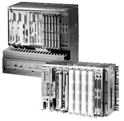

# Historia del PLC, Modicon, Modbus

La historia del PLC (Control Lógico Programable) inicio cuando apareció el propósito de eliminar el enorme costo que significaba el reemplazo de un sistema de control basado en relés (relays) a finales de los años 60. La empresa Bedford Associates (Bedford, MA) propuso un sistema al que llamó Modular Digital Controller o MODICON a una empresa fabricante de autos en los Estados Unidos.El MODICON 084 fue el primer PLC producido comercialmente. Con este Sistema cuando la producción necesitaba variarse, entonces se variaba el sistema y este estaba listo para seguir trabajando.

En el sistema basado en relés, estos tenían un tiempo de vida limitado y se necesitaba un sistema de mantenimiento muy estricto. El alambrado de muchos relés en un sistema muy grande era muy complicado, si había una falla, la detección del error era muy tediosa y lenta.

Este nuevo controlador (el PLC) tenía que ser fácilmente programable, su vida útil tenía que ser larga y ser resistente a ambientes difíciles. Esto se logró con técnicas de programación conocidas y reemplazando los relés por elementos de estado sólido.

A mediados de los años 70, la AMD 2901 y 2903 eran muy populares entre los PLC MODICON. Por esos tiempos los microprocesadores no eran tan rápidos y sólo podían compararse a PLCs pequeños. Con el avance en el desarrollo de los microprocesadores (más veloces), cada vez PLC más grandes se basan en ellos. La habilidad de comunicación entre ellos apareció aproximadamente en el año 1973. El primer sistema que lo hacía fue el Modbus de Modicon.

Los PLC podían incluso estar alejados de la maquinaria que controlaban, pero la falta de estandarización debido al constante cambio en la tecnología hizo que esta comunicación se tornara difícil.

En los años 80 se intentó estandarizar la comunicación entre PLCs con el protocolo de automatización de manufactura de la General Motors (MAP). En esos tiempos el tamaño del PLC se redujo, su programación se realizaba mediante computadoras personales (PC) en vez de terminales dedicadas sólo a ese propósito.

En los años 90 se introdujeron nuevos protocolos y se mejoraron algunos anteriores. El último estándar (IEC 1131-3) ha intentado combinar los lenguajes de programación de los PLC en un solo estándar internacional. Ahora se tiene PLCs que se programan en función de diagrama de bloques, listas de instrucciones, lenguaje C, etc. al mismo tiempo. También se ha dado el caso en que computadoras personales (PC) han reemplazado a PLCs.

La compañía original que diseño el primer PLC (MODICON) ahora crea sistemas de control basados en PC.
