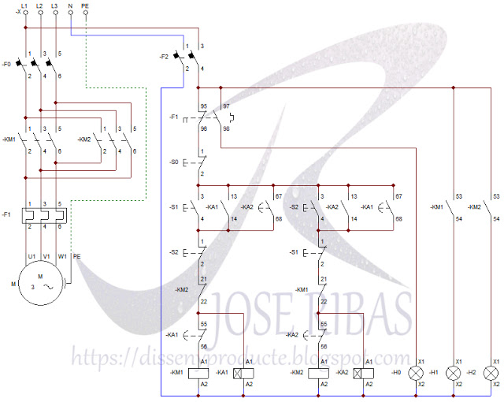
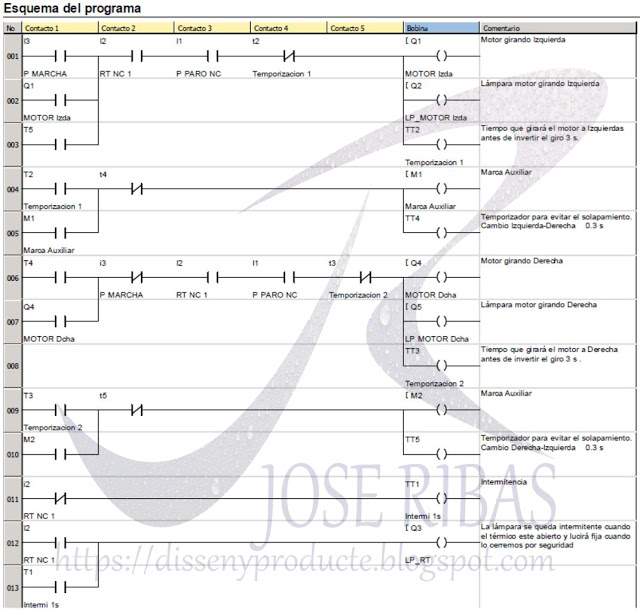

# Lógica cableada

Consiste en el diseño de automatismos mediante la utilización de circuitos cableados, utilizando para ello contactos auxiliares de relés electromecánicos, contactores de potencia, relés temporizados, relés contadores, válvulas óleo-hidráulicas y neumáticas, así como demás elementos según las necesidades demandadas por el cliente. Los circuitos cableados incluyen funciones de mando y control, de señalización, de protección y de potencia. Sin olvidar la correspondiente protección de la instalación mediante sus correspondientes elementos de protección, magnetotérmicos, guardamotores, variadores de frecuencia, fuentes de potencia y diferenciales. Cualquier cambio en la programación de la instalación, pasará por modificar el cableado y los elementos de forma que cumplan las nuevas funciones de mando, protección y potencia. Los automatismos de lógica cableada se suelen emplear en instalaciones pequeñas y en lugares críticos donde la seguridad de personas y máquinas no puede depender de la lógica programada. Aunque hay que señalar que hoy en día, se ha avanzado mucho en este terreno de la seguridad y existen detectores y autómatas programables especialmente diseñados para controlar la seguridad de las personas.

# Lógica programada

En esta se sustituyen los elementos utilizados en los circuitos de mando ( contactos auxiliares de relés electromecánicos, contactores de potencia, relés temporizados, relés contadores, etc. ) por PLC's, Autómatas Programables o Relés programables. Esto nos permite realizar cambios en las operaciones de mando, mediante el cambio de la programación, y por ello no tener que modificar el cableado. Aunque los fundamentos de la programación de la lógica programada son similares, cada fabricante utiliza una nomenclatura y un software específico para ello. Según la norma IEC, nos podremos encontrar con los lenguajes KOP ( conocido como lenguaje de contactos ), FUP ( conocido como lenguaje de puertas lógicas ) y AWL ( conocido como lenguaje en modo texto ).

